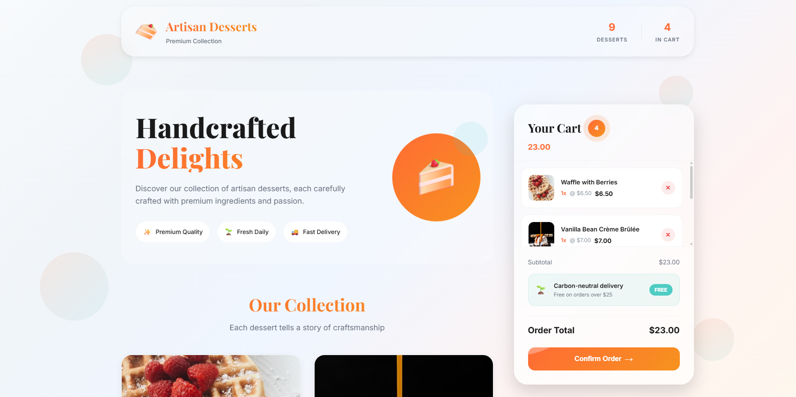

# 🍰 Artisan Desserts — Premium Collection

> _A luxurious digital showcase of handcrafted artisan desserts, combining elegant design with seamless e-commerce functionality_



### ✨ **[Experience the Collection Live](https://bhavishyjain.github.io/food-web)** ✨

_Indulge in our premium dessert experience_

---

## 🎨 **What Makes It Special**

This isn't just another dessert website—it's a carefully crafted digital experience that brings the artistry of premium desserts to life through code. Every element, from the elegant typography to the smooth cart animations, has been designed to mirror the quality and attention to detail found in our artisan creations.

---

## ✨ **Premium Features**

### 🎭 **Visual Excellence**

- **Typography Perfection** — Google Fonts _Inter_ & _Playfair Display_ create a sophisticated brand identity
- **Responsive Mastery** — Flawlessly adapts from desktop to mobile without losing elegance
- **Artistic Elements** — Floating decorative shapes and custom gradients add visual depth
- **Professional Loading** — Branded loading animation sets the premium tone from first visit

### 🛍️ **Shopping Experience**

- **Dynamic Product Showcase** — JavaScript-powered grid that brings desserts to life
- **Intelligent Cart System** — Real-time updates with smooth sidebar interactions
- **Smart Calculations** — Automatic pricing with professional order summaries
- **Confirmation Delight** — Beautiful modal feedback that completes the purchase journey

### ⚡ **Technical Craftsmanship**

- **Clean Architecture** — Semantic HTML5 with accessibility in mind
- **Modern CSS Magic** — Flexbox, Grid, and buttery-smooth animations
- **Vanilla JavaScript** — Pure ES6+ for lightning-fast performance
- **Universal Compatibility** — Works beautifully across all modern browsers

---

## 🚀 **Get Started Instantly**

### Quick Launch

```bash
# Clone the elegance
git clone https://github.com/bhavishyjain/food-web.git

# Enter the world of artisan desserts
cd food-web

# Launch your local dessert boutique
python -m http.server 8000
```

Then visit `http://localhost:8000` and prepare to be delicious-ly impressed! 🎉

---

## 🛠️ **Built With Love Using**

| Technology          | Purpose       | Why We Chose It                      |
| ------------------- | ------------- | ------------------------------------ |
| **HTML5**           | Structure     | Semantic, accessible foundation      |
| **CSS3**            | Styling       | Modern layouts with stunning effects |
| **JavaScript ES6+** | Interactivity | Clean, performant user experience    |
| **Google Fonts**    | Typography    | Professional, web-optimized fonts    |

---

## 🔮 **Future Delights**

_Coming soon to make your dessert experience even sweeter:_

- 🔗 **Backend Integration** — Persistent cart and order management
- 🔍 **Smart Search** — Find your perfect dessert instantly
- ♿ **Enhanced Accessibility** — ARIA attributes and keyboard navigation
- ⚡ **Performance Boost** — SEO optimization and lightning-fast loading

---

## 👨‍💻 **Crafted By**

**Bhavishy Jain**  
_Digital Artisan & Code Enthusiast_

[](https://github.com/bhavishyjain)
[](https://bhavishyjain.vercel.app/)

---

### 🌟 **Love this project?**

Give it a ⭐ and share the sweetness with others!

_Made with 💝 and lots of ☕ for dessert lovers everywhere_
